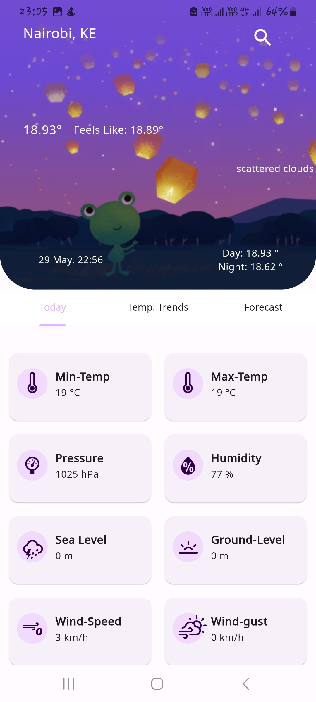
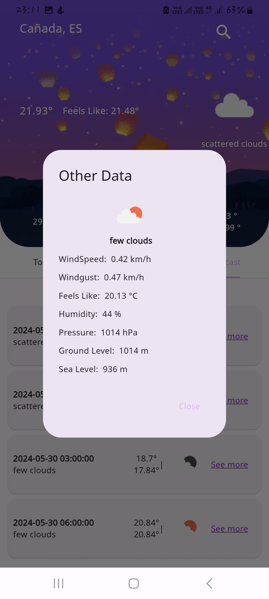
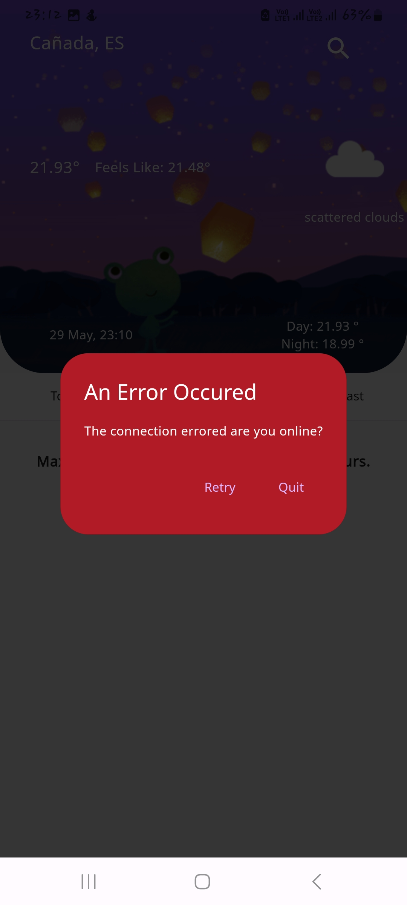
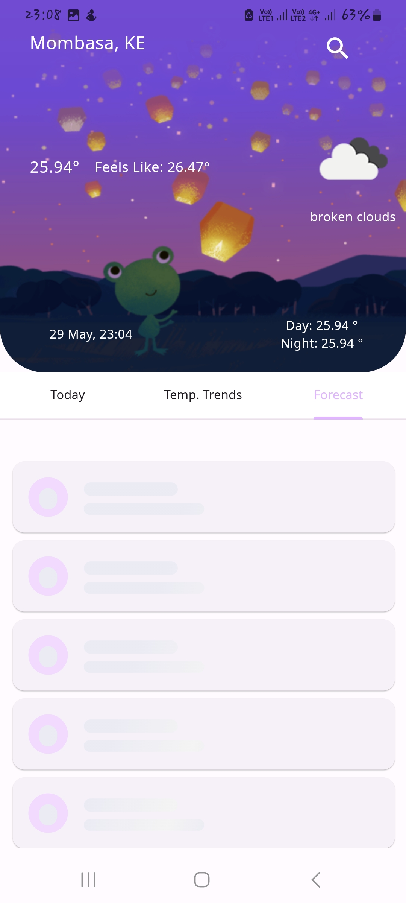
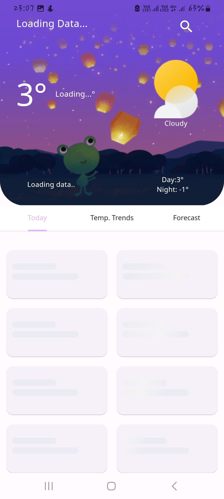
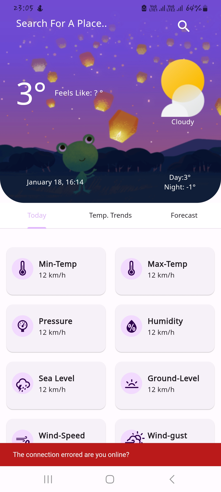
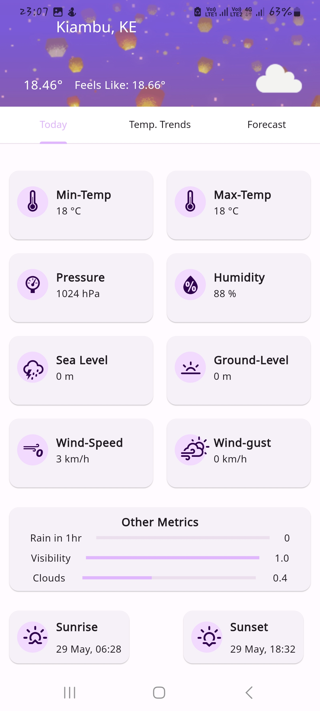
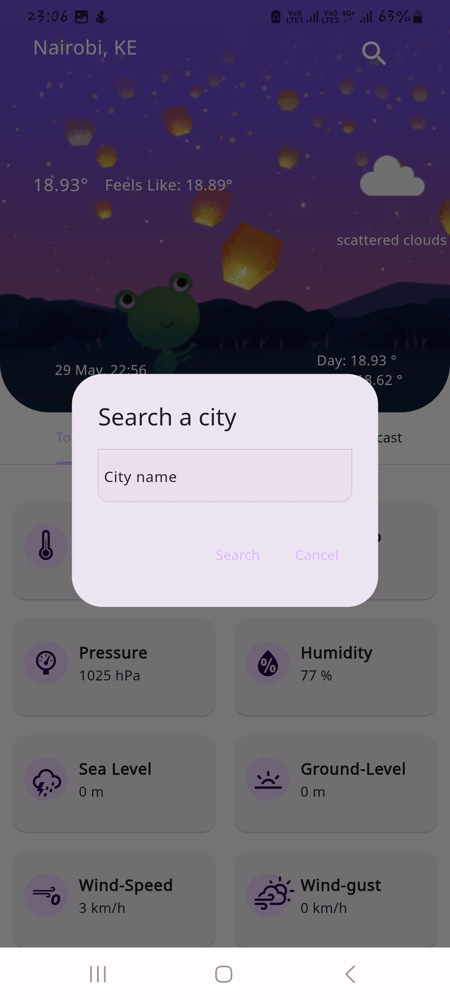
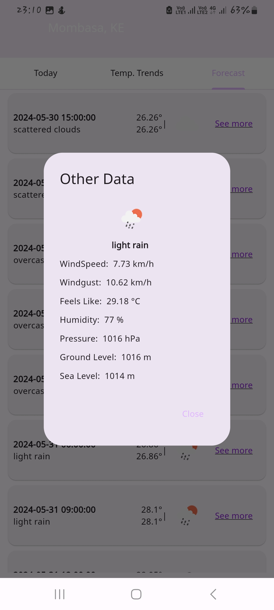
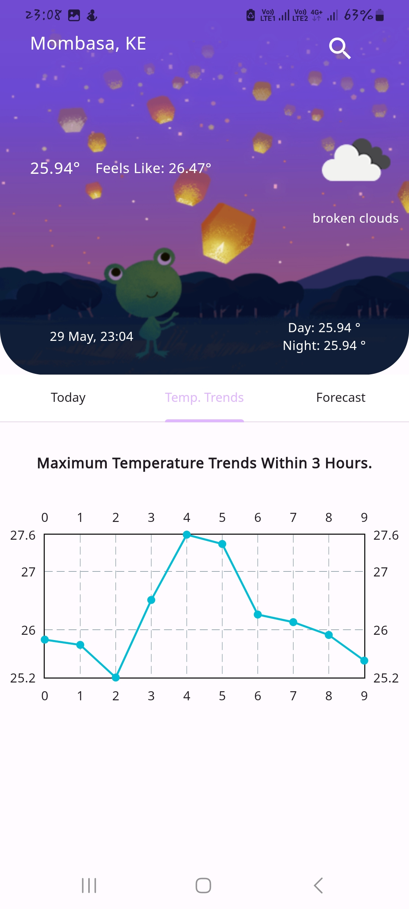

# Flutter Project

This is a flutter project that queries for weather data including weather forcasts for 5 days with a 3 hour difference.

## Project Structure

- `lib/`:This is where the main Dart code resides.
  - `common/`:This is the directory with all files used across the app
  - `di/`: This is a directory that holds all dependency injection files in the project
  - `features/`:This is a directory that contains all the feature implementation code in the project
  - `router/`: This is a folder that holds all the app's routing logic
- `assets/`: This is a folder containing all the assets like images used in the project

## Packages Used

- `flutter_bloc`: This package is used for state managemant.
- `injectable`: Used as a code generator for getIt used in dependency injection
- `intl`: Used for proper date and time formatting
- `build_runner`: used to run code generation scripts
- `equatable`: used for equality in objects
- `dartz`: used for functional programming logic
- `go_router`: used for routing purposes
- `skeletonizer`: used for proper loading experience and visuals
- `cached_network_image`: Used for caching network images
- `dio`: used for carrying out network requests
- `fl_chart`: used for drawing of line graphs
- `flutter_color_scheme`: for theming purposes
- `google_fonts`: for a wide variety of google specific fonts like sans

## Logic

- The app has mainly two main features namely `GetCurrentWeather` and `GetForeCast` with the earlier just fetching for the current weather while the later gets the weather forecast.

- These two features work in the sense that a user fills in the information about the `city` they want to query the data and then the data is retrieved from the open weather map `API endpoint`.

- If no data regarding the city or weather data is found then there are corresponding messages to show you that.

- The weather forecast feature also works in the same way but the difference is in the data retrieved.

- Proper error handling has also been enforced by the use of try catch blocks and proper functional programming paradigms alongside my state logic.

- Nice visual experience from the `line graph` mapping all values of the `maximum temperatures` to their corresponding indices clearly showing the trends

- Nicely formatted `weather icons` both from `open weather map` and my weather icons package.

- Step by step breakdown of how it works

  - User keys in city name and an event is triggered which goes and interacts with my `state management logic` which reaches out to the `data repositories` which inturn reach out to the required `api endpoint`.

  - If request is successful data is retrieved or if unsuccessfull an error message returned to the user with the specific error.

  - The data reaches my `state management logic` formed by `Blocs` and then the UI can be `repainted` with the data on various screens of the project

  - All these happens with `respective changes` of the states giving definitive user feedback on the screen

## Running the Project

- First you'll have to create a `.env` file at the `root` of you project.

- Copy and Paste this inside there

`API_KEY = c35e303ef69236e3be78dbbfcdf26074`

- Then all is set, `run the project` with the following commands.

```
flutter pub get
flutter run

```

## APK

Find the apk at the root directory of the project. `uza_weather.apk`

## Screenshots

Here are some of the screenshots taken from the app.










